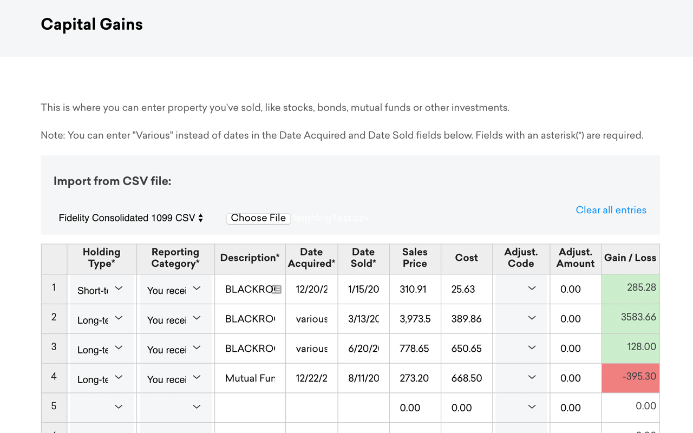

# CreditKarma Tax 1099-B Import Extension

Chrome Extension that adds import features to the [CreditKarma tax](https://creditkarma.com/tax) interface to allow CSV files of capital gains information.

## Install

[Install the Extension](https://chrome.google.com/webstore/detail/dehmakdmiooeomgajgfjjfibkelmheob)

After installation, when you visit the Credit Karma Cap Gains form, you will see an "Import from CSV file" section.

https://tax.creditkarma.com/taxes/CapitalGainsFullListSummary.action



## Usage

CSV files can be imported by choosing a format in the dropdown, and then "Choose File" and selecting the csv file from your computer.

The import will not overwrite any rows that already have a description, sale price or cost.

If Gain/Loss does not update, clicking "Next" will save/refresh those numbers.

You can clear the whole table by selecting "Clear all entries" and then click the green "Next" button. 

This extension and software is not developed or affiliated with Credit Karma.

It it the users responsibility to review all imports to make sure they are correct.

## Known Issues

The Gain/Loss does not update sometimes. This column is calculated on the page based of price and cost basis,  clicking the green  "Next" button will save/refresh those numbers.

## Import Sources/Formatting

## Current Support For:

* Fidelity Consolidated 1099
* [CoinTracking.info](https://cointracking.info/tax/)

## Default CSV Formatting

The default importer is looking for the following headers in row 1.

| Header Name     | Values          | 
| -------------   |---------------|
| **holdingType** | long or short |
| **reportingCategory** | 1 = 1099 was reported, 2 = 1099 not reported, 3 = no 1099 |
| **description** | description of sale |
| **dateAcquired** | mm/dd/yyyy |
| **dateSold** | mm/dd/yyyy |
| **salesPrice** | 0.00 |
| **costBasis** | 0.00 |


Example csv:
```
holdingType,reportingCategory,description,dateAcquired,dateSold,salesPrice,costBasis
long,1,Some Stock,12/02/2007,03/04/2017,1234.50,325.55
short,2,Some Fund,10/15/2016,03/04/2017,5500.55,5000.00
```


## License

[MIT License](LICENSE)
