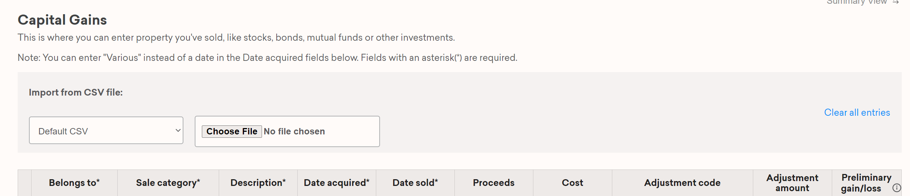

# CreditKarma Tax 1099-B Import Extension

Chrome Extension that adds features to the [CreditKarma Tax Capital Gains interface](https://tax.creditkarma.com/taxes/CapitalGainsFullListSummary.action) to allow CSV file imports.

## Install

[Install the Extension](https://chrome.google.com/webstore/detail/dehmakdmiooeomgajgfjjfibkelmheob)

After installation, when you visit the Credit Karma Cap Gains form, you will see an "Import from CSV file" section.

https://tax.creditkarma.com/taxes/CapitalGainsFullListSummary.action



## Usage

CSV files can be imported by choosing a format in the dropdown, and then "Choose File" and selecting the csv file from your computer.

Your file data is only accessed in-browser (it is not sent, saved or processed outside your computer).

The import will not overwrite any rows on CreditKarma that already have a description, sale price or cost.

If Gain/Loss does not update, clicking "Next" will save/refresh those numbers.

You can clear the whole table by selecting "Clear all entries" and then click the green "Next" button. 

This extension and software is not developed or affiliated with CreditKarma.com.

It it the users responsibility to review all imports to make sure they are correct.

## Known Issues

* We didn't test all possible adjustment code
* UI above shows "Sale category" but you need to use "reportingCategory" in CSV files
* If you don't have adjustment amount transaction, you still need to leave adjustment code blank & adjusted amount 0.00
* After recent update test was done only for default importer, for fidelity, cointracking & bitcoin please check the code before using
## Import Sources/Formatting

### Current Support For:

* [Fidelity](https://www.fidelity.com/) - Consolidated 1099 CSV
* [CoinTracking.info](https://cointracking.info/tax/) - Tax CSV Export
* [Bitcoin.tax](https://bitcoin.tax/home#reports) - Tax CSV Export

### Default CSV Formatting

The default importer is looking for the following headers in row 1.

| Header Name     | Values          | 
| -------------   |---------------|
| **belongsTo** | tp (Primary), sp (Spouse), or bt (Both) |
| **reportingCategory** | [details below](#reporting-category) |
| **description** | description of sale |
| **dateAcquired** | mm/dd/yyyy |
| **dateSold** | mm/dd/yyyy |
| **salesPrice** | 0.00 |
| **costBasis** | 0.00 |
| **adjustmentCode** | [details below](#adjustment-code) |
| **adjustmentAmount** | 0.00 |

##### Reporting Category
|Value|Description|
|---|---|
|1|Box A - Short Term covered|
|2|Box B - Short Term not covered|
|3|Box C - Short Term not reported|
|4|Box D - Long Term covered|
|5|Box E - Long Term not covered|
|6|Box F - Long Term not reported|

##### Adjustment Code
|Code|Adjustment Code Description|
|---|---|
|B|You received a Form 1099-B (or substitute statement) and the basis shown in box 3 is incorrect|
|T|You received a Form 1099-B (or substitute statement) and the type of gain or loss (short term or long term) shown in box 1c is incorrect|
|N|You received a Form 1099-B or 1099-S (or substitute statement) as a nominee for the actual owner of the property|
|H|You sold or exchanged your main home at a gain, must report the sale or exchange on Part II of Form 8949 (as explained in Sale of Your Home in the Instructions for Schedule D (Form 1040)), and can exclude some or all of the gain|
|Q|You sold or exchanged qualified small business stock and can exclude part of the gain|
|X|You can exclude all or part of your gain under the rules explained in the Schedule D instructions for DC Zone assets or qualified community assets|
|R|You are electing to postpone all or part of your gain under the rules explained in the Schedule D instructions for any rollover of gain (for example, rollover of gain from QSB stock or publicly traded securities)|
|W|You have a nondeductible loss from a wash sale|
|L|You have a nondeductible loss other than a loss indicated by code W|
|E|You received a Form 1099-B or 1099-S (or substitute statement) for a transaction and there are selling expenses or option premiums that are not reflected on the form or statement by an adjustment to either the proceeds or basis shown|
|S|You had a loss from the sale, exchange, or worthlessness of small business (section 1244) stock and the total loss is more than the maximum amount that can be treated as an ordinary loss|
|C|You disposed of collectibles (see the Schedule D instructions)|
|M|You report multiple transactions on a single row as described in Exception 1 or Exception 2 under Exceptions to reporting each transaction on a separate row|
|O|You have an adjustment not explained earlier in this column|
|B,T|Both codes B and T apply|
|B,W|Both codes B and W apply|
|T,W|Both codes T and W apply|
|B,T,W|Codes B, T, and W all apply|


##### Example default csv:
```
belongsTo,reportingCategory,description,dateAcquired,dateSold,salesPrice,costBasis,adjustmentCode,adjustmentAmount
tp,1,Some Stock,12/02/2007,03/04/2017,1234.50,325.55,,0.00
sp,2,Some Fund,10/15/2016,03/04/2017,5500.55,5000.00,D,10.00
bt,3,Some Fund,10/15/2016,03/04/2017,5500.55,5000.00,W,200.25
tp,4,Some Stock,12/02/2007,03/04/2017,1234.50,325.55,,0.00
sp,5,Some Fund,10/15/2016,03/04/2017,5500.55,5000.00,B,100.00
bt,6,Some Fund,10/15/2016,03/04/2017,5500.55,5000.00,T,500.80
```


## License

[MIT License](LICENSE)

## Contributing

Pull Requests are encouraged.

Importers are modules with the following properties:

**textToLines(csvText)** - (optional) - function that takes the text of the csv file as a param, and returns an array of the rows. If this function is not provided, the default behavior is the first row of the csv is used as header properties, and returns an array of objects with named properties. [see importers/default.js](importers/default.js#L5)

**parseCsvRow(csvRow)** - (required) - function that takes a row of the array returned from `textToLines` as a param, and returns an object with the following properties:  [see importers/default.js](importers/default.js#L37)

```javascript
{
    belongsTo: "tp",  // tp (Primary), sp (Spouse), or bt (Both) 
    reportingCategory: "3", // refer to reporting category values & description above
    description: "Sold this security",
    dateAcquired: "5/25/2016", // format mm/dd/yyyy
    dateSold: "5/25/2017", // format mm/dd/yyyy
    salesPrice: 5500.50,
    costBasis: 2500.00,
    adjustmentCode: "W", // refer to adjustment code & description above
    adjustmentAmount: 100.00

}
```


Example Importer:

```javascript
var CKI = CKI || {};
CKI.Importers = CKI.Importers || {};

CKI.Importers.exampleImporter = {
	constants: {
		BELONGS_TO = "Belongs To", // tp (Primary) OR sp (Spouse) OR bt (Both)
		REPORTING_CATEGORY: "Reporting Category", // refer to reporting category values & description above		
		DESCRIPTION: "Description",
		ACQUIRED_COLUMN: "Date Acquired",
		SOLD_COLUMN: "Date Sold",
		COST_BASIS_COLUMN: "Cost Basis",
		PROCEEDS_COLUMN: "Proceeds",
		ADJUSTMENT_CODE: "Adjustment Code", // refer to adjustment code & description above
		ADJUSTMENT_AMOUNT: "Adjustment Amount"
	},

	parseCsvRow: function(sourceObj) {
		var obj = {
			belongsTo: sourceObj[this.constants.BELONGS_TO],
			reportingCategory: sourceObj[this.constants.REPORTING_CATEGORY],
			description: "Sold " + sourceObj[this.constants.DESCRIPTION],
			dateAcquired: (sourceObj[this.constants.ACQUIRED_COLUMN]) ? sourceObj[this.constants.ACQUIRED_COLUMN] : 'Various',
			dateSold: (sourceObj[this.constants.SOLD_COLUMN]) ? sourceObj[this.constants.SOLD_COLUMN] : 'Various',
			salesPrice: parseFloat(sourceObj[this.constants.PROCEEDS_COLUMN]),
			costBasis: parseFloat(sourceObj[this.constants.COST_BASIS_COLUMN]),
			adjustmentCode: sourceObj[this.constants.ADJUSTMENT_CODE],
			adjustmentAmount: parseFloat(sourceObj[this.constants.ADJUSTMENT_AMOUNT]),
		}
		return obj;
	}
};
```
